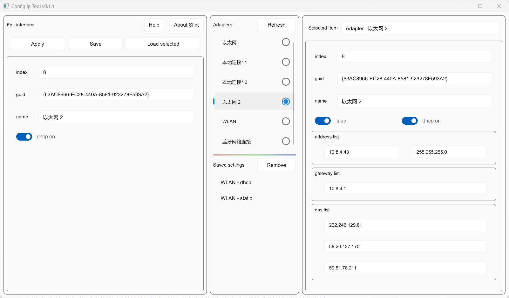

# Cfg-IP

A simple tool to config ip in windows, written in `Rust`. The UI is made by [Slint](https://github.com/slint-ui/slint)

[中文文档](./README_zh.md)

## Usage

1. When you run the app, the system current adapters are loaded to the list in `Adapters`, or you can click `Refresh` to reload.
2. Choose one of the adapters to see details.
3. Select one in step 2, then click `Load selected`. The adapter info is loaded to the left area.
4. Do some change in the left area, click `Apply` or `Save` when you finished, or `Load selected` to discard the changes.
   1. The app support multiple ip when `dpch on` is unchecked. Each line represent one address. Please fill the `ip` and `netmask` list with same count, while each ip must match a netmask.
   2. `gateway` and `dns list` also support multiple address.

If you saved some items in step 4, then you can choose and select them, like step 2 & 3.

## Notice

The app use `netsh` command tool to do the config, you would see a black console window when clicking `Apply`, since I don't hide them. Please close the window when seeing "You can close the window now.".
